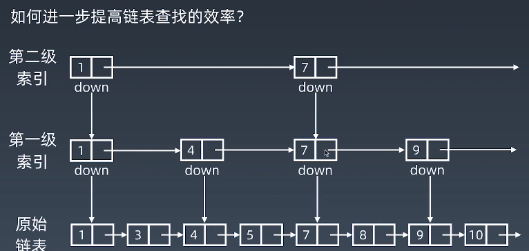
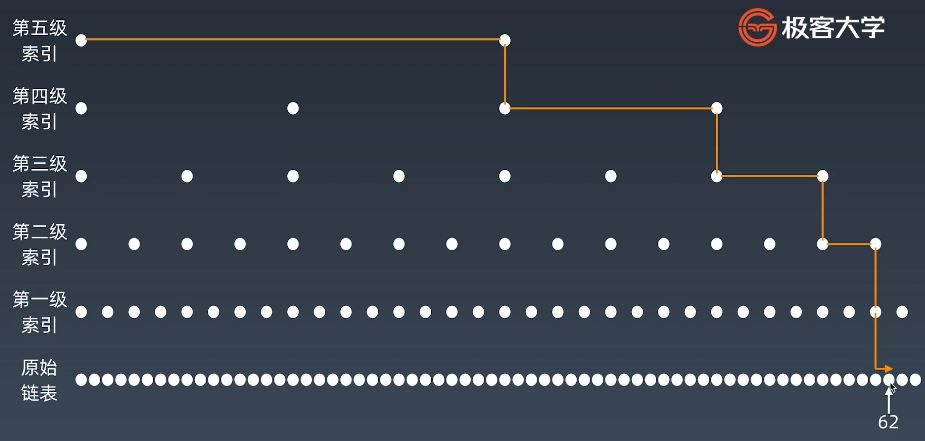

学习笔记

比起学习笔记，在做算法题时，学到别人的题解收获更大。

[三数之和](https://github.com/crane0/algorithm009-class01/tree/master/Week_01/三数之和.js)

---

下面是学习笔记

# 1，数组

每当申请一个数组，计算机实际上是在内存中开辟了一段连续的地址，每个地址可以通过**内存管理器**进行访问。

- 随机访问高效，增删低效

访问数组的任何一个元素的时间复杂度，O(1)

对于增删元素时，需要将后面的元素进行群移，并且如果数组长度不够的话，还需要将原来的元素复制到新的数组中。时间复杂度O(n)（最坏+最好）

1，正常情况下，向数组的头 prepend 时，时间复杂度是 O(n)，但是可以进行特殊优化到 O(1)。

> 申请较大的内存空间，在数组最开始进行预留，prepend 操作就是将头下标前移一个位置。 

- prepend，O(1)
- append，O(1)
- lookup，O(1)
- insert，O(n)
- delete，O(n)

# 2，链表

- 增删高效，访问低效

增删元素时，O(1)，因为只需要将 next 指针指向对应的元素，没有群移，不需要复制。

访问时，要一个一个往后进行寻找，平均是 O(n)

- prepend，O(1)
- append，O(1)
- lookup，O(n)
- insert，O(1)
- delete，O(1)

# 3，跳表 skipList

前提：只能用于链表中的元素有序时。

所以，跳表对标的是平衡树（AVL Tree）和二分查找，是一种插入/删除/搜索 都是 O(logn) 的数据结构。

优势：原理简单，容易实现，方便扩展，效率更高。因此在一些热门的项目中来代替平衡树，如 Redis、LevelDB 等。

## 3.1，Tip

一维数据结构要加速，就要升维，空间换时间。

> 升维后，会有多一级的信息在里面。可以帮助得到在一维中必须挨个走才能找到的元素。

## 3.2，跳表的时间复杂度是 O(logn)

n/2,n/4,n/8, 第k级索引节点的个数是 n/(2^k)

假设索引有 h级，最高级的索引有2个节点，n/(2^h) = 2，所以索引的高度 h = log2(n) - 1，

而每层索引遍历的节点是 2个，所以时间复杂度是 O(logn)

## 3.3，跳表空间复杂度分析

原始链表大小为 n，每 2个节点抽 1 个，每层索引的结点数，

n/2, n/4, n/8, ... 8, 4, 2

加起来，空间复杂度是O(n)

> 每3个结点抽也一样。

# 4，实战

练习实战的步骤
- 5-10分钟，读题和思考
- 有思路，自己写；不然，马上看题解
- 默写。背诵
- 自己写（闭卷）

5遍刷题法。

这些全部搞定，去国际站（去掉cn）看看别人的。

